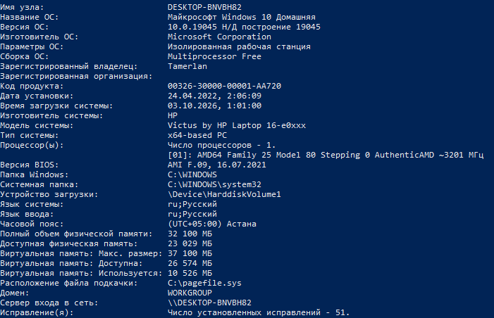
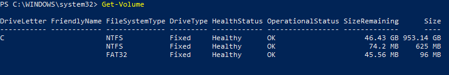

# Lab 0 — Inventory your own machine

Pair: DAMIR NIYAZBEK (My pair) <br/>
Driver first half: TAMERLAN SHAKENOV (Me) <br/>
Machine: HP Victus 16-e0XXX (Laptop) <br/>
Date: 08.10.2026

## What I did
I used Windows PowerShell to collect information about my personal laptop, including the operating system, hardware specifications, processor, memory, and storage. Here are the commands I used: <br/>
Overview - ```Get-ComputerInfo``` <br/>
Memory - ```systeminfo``` <br/>
Disks - ```Get-Volume``` <br/>
OS - ```systeminfo``` <br/>
Virtualisation - ```systeminfo``` Hyper-V Requirements (on the bottom of the output) <br/>

```Get-ComputerInfo``` <br/>  <br/>

```systeminfo``` <br/> 
 <br/>

```Get-Volume```<br/>  <br/>


## Result
Successfully collected basic system information using Windows PowerShell. The inventory included the operating system, processor, installed memory, storage devices, and computer model.

The commands demonstrated how to query Windows system information using built-in PowerShell commands without installing additional software.

## What did not work the first time
The RAM value was displayed in megabytes, which was less convenient to read. I interpreted the value and converted it to gigabytes for easier understanding.

## Evidence
- [evidence/disks.png](evidence/disks.png) - Disks info.
- [evidence/hyper-v.png](evidence/hyper-v.png) - Hyper-V (Virtualisation) info.
- [evidence/os-cpu-memory.png](evidence/os-cpu-memory.png) - OS, CPU and RAM memory info.
- [evidence/os.png](evidence/os.png) - OS info that is shown by using the overview command.
